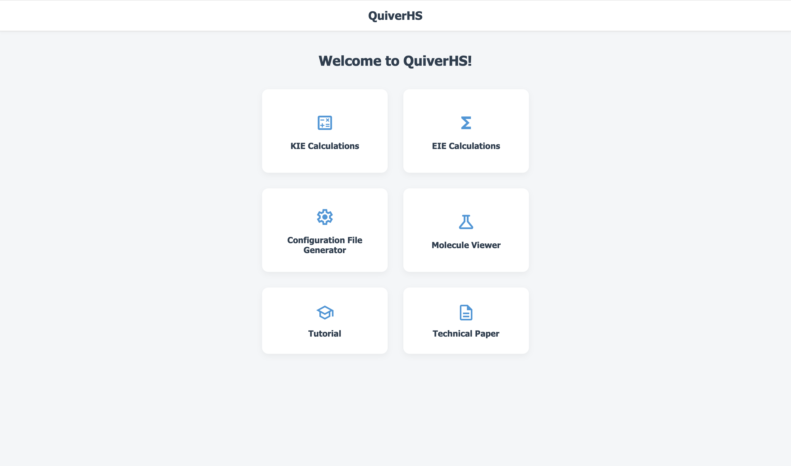

# Welcome to PyQuiverHS
## INTRODUCTION

*PyQuiverHS is a user-friendly web app for calculating isotope effects with separable Bigeleisen–Mayer, enthalpic, and entropic contributions. PyQuiverHS builds on the PyQuiver code base, a Python code written by @ekwan, by introducing a graphical user interface (GUI) that provides a simple point-and-click user experience and the ability to analyze Bigeleisen–Mayer, enthalpic, and entropic contributions separately. The source code is shared here in the spirit and practice of open source software, but the simplest and recommended way to use PyQuiverHS is through our web app, which is free to use here:*

https://www.isotope-effects.com/ 

PyQuiverHS is an open-source web-based application to calculate Kinetic Isotope Effects (KIE) and Equilibrium Isotope Effects (EIE) using harmonic frequencies and both the Bigeleisen-Mayer (B-M) formalism and a thermodynamic approach that partitions isotope effects into their enthalpic and entropic (H-S) components. Additionally, this program directly calculates and displays the component of each approach separately. PyQuiverHS is based on PyQuiver, which requires Cartesian Hessian matrices that can be calculated using the Gaussian electronic structure program.

## FEATURES
- Automatically read frequencies from [`Gaussian`](http://www.gaussian.com/g_prod/g09.htm) output files.
- Ability to view the molecules from the generated Gaussian files.
- Two separate methods for computing the isotope effects:
    - Thermodynamic enthalpy-entropy approach (H-S)
    - Bigeleisen-Mayer formalism (B-M)
- Ability to view and compare the component contributions for each approach, including:
    - Zero-point energy contributions to enthalpy (H_ZPE) for H-S
    - Vibrational contributions to enthalpy (H_VIB) for H-S
    - Total thermal vibrational contributions to enthalpy (H_ZPE * H_VIB = H_TOT) for H-S
    - Vibrational contributions to entropy (S_VIB) for H-S
    - Rotational contributions to entropy (S_ROT) for H-S
    - Total contributions to entropy (S_VIB * S_ROT = S_TOT) for H-S
    - Total free energy contributions to isotope effect (H_TOT * S_TOT = G_TOT = HS) for H-S
    - Mass and moment of inertia (MMI) factor for B-M
    - Zero-point energy (ZPE) factor for B-M
    - Excitation (EXC) factor for B-M
    - Total contributions to isotope effect (MMI * ZPE * EXC = BM) for B-M
- Ability to rapidly calculate temperature ranges with custom increments. 
- Simple and accessible output file formats, such .csv and .txt
- Automatically generated plots for temperature ranges.

## TUTORIALS
To learn how to use this program, please see the tutorial:
https://www.isotope-effects.com/tutorials

## AUTHORS
Author Contributions for PyQuiverHS: 
- Gianmarc Grazioli: supervision, conceptualization, software, writing-original draft. 
- Andrew Ly: software. 
- Dianoosh Sabetnejad: software. 
- Anvitha Mattapalli: software.  
- Calvin T. Nguyen: software. 
- Daniel J. O’Leary: supervision, conceptualization, writing-original draft.

Correspondence:
- Prof. Daniel J. O'Leary, Dept. of Chemistry at Pomona College  (doleary@pomona.edu)
- Assoc. Prof. Gianmarc Grazioli, Dept. of Chemistry at San Jose State University (gianmarc.grazioli@sjsu.edu)

The repository for PyQuiver (written by @ekwan), the open-source code that provided the foundation upon which PyQuiverHS was built, is found here:
https://github.com/ekwan/pyquiver

## HOW TO CITE
A manuscript introducing PyQuiverHS is currently under peer review. It is titled:
“PyQuiverHS: A Web Tool for Computing Isotope Effects”
By: Gianmarc Grazioli1, Andrew Ly1, Dianoosh Sabetnejad1, Anvitha Mattapalli1, Calvin T. Nguyen1, and Daniel J. O’Leary2 
1. Department of Chemistry, San José State University, San Jose, CA (USA)
2. Department of Chemistry, Pomona College, Claremont, CA (USA)

A citable preprint of our paper with a doi is available via ChemRxiv here:
PyQuiverHS: A Web Tool for Computing Isotope Effects
https://chemrxiv.org/doi/full/10.26434/chemrxiv.15004570/v1 

## LICENSE
PyQuiverHS is licensed under the Apache License 2.0. See the LICENSE file for details.
