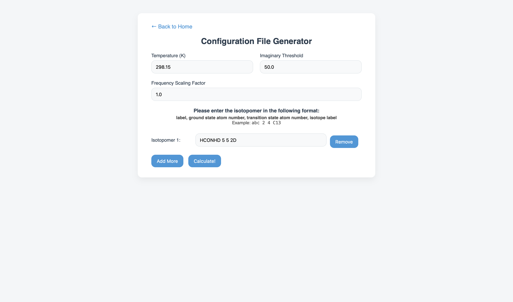
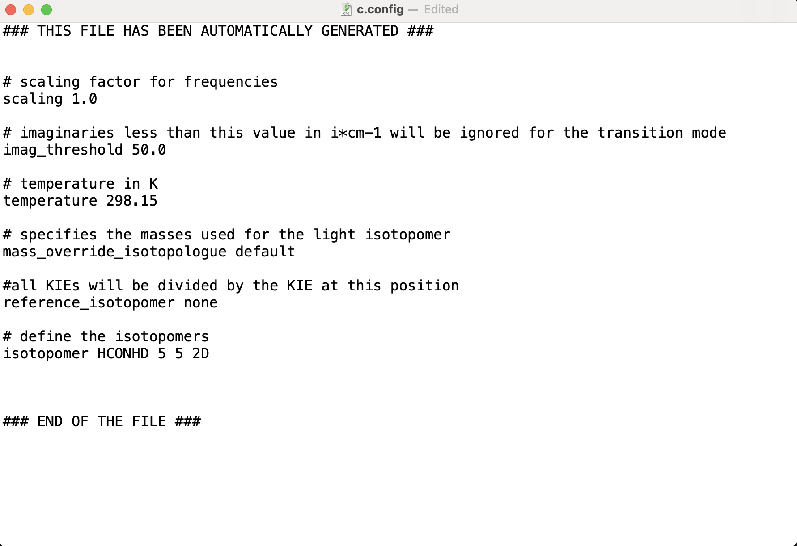
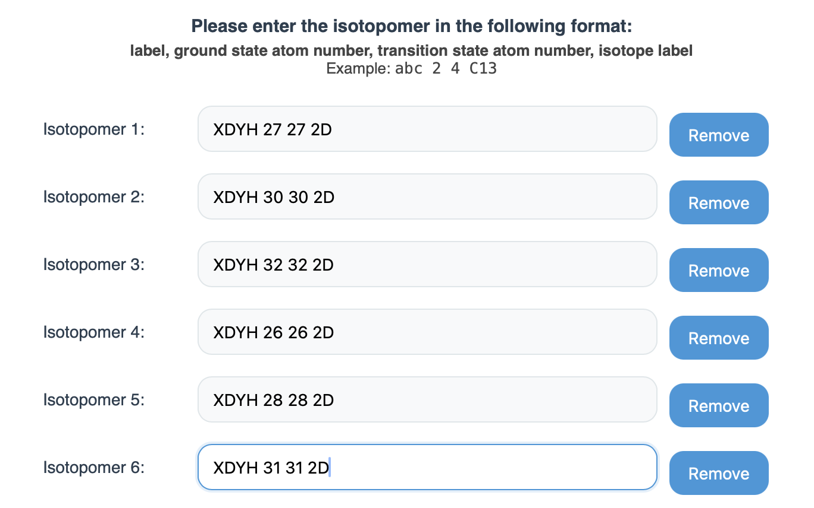

# CONFIGURATION FILE GENERATOR
In this tutorial, we will generate the configuration file used in the KIE tutorial.
1. Select the desired temperature. Note that the temperature indicated during the EIE or KIE calculation _will_ replace this temperature.
2. Select an imaginary threshold. If left unchanged, the program will automatically choose 50 cm-1 as its default value. For KIE calculations, it is important that you consult the transition state's Gaussian file to choose an appropriate imaginary threshold (Ctrl + F for "imaginary"). The reason for this is that unavoidable floating point numerical errors can lead to low wavenumber positive normal modes registering as negative, leading to those modes being artificially identified as imaginary transistion state modes. The threshold defines a “dead zone” near zero where slightly negative frequencies are ignored as numerical noise (e.g. if 50 cm-1 is the threshold, -40 cm-1 would not be considered imaginary and -60 cm^-1 would). Thus, select an imaginary threshold such that the lowest negative frequency is the only allowed imaginary value.
3. Select a scaling factor for the frequencies. If left unchanged, the program will automatically choose 1 as its default value.
4. Choose the isotopic desired isotopic exchanges, separate each section with a single space:
- Select a label; the label can be any name. If two or more isotopic exchanges are desired, ensure that both isotopomers share the same label (third picture).
- Select the ground state/reactant atom number; the molecular viewer provides both a 3D representation and the atom numbers.
- Select the transition state/product atom number.
- Select the Isotope to be replaced; choose from the list provided.
5. Press "Calculate!"

If done correctly, your output will resemble the following: 

For the case of mutiple isotopic substitution, indicate all isotopomers with the same label as follows:

## Possible replacements
### Hydrogen
* Protium: 1H
* Deuterium: 2D
* Tritium: 3T
### Carbon
* Carbon-12: 12C
* Carbon-13: 13C
* Carbon-14: 14C
### Nitrogen
* Nitrogen-14: 14N
* Nitrogen-15: 15N
### Oxygen
* Oxygen-16: 16O
* Oxygen-17: 17O
* Oxygen-18: 18O
### Fluorine
* Fluorine-18: 18F
* Fluorine-19: 19F