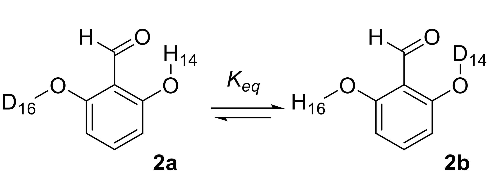
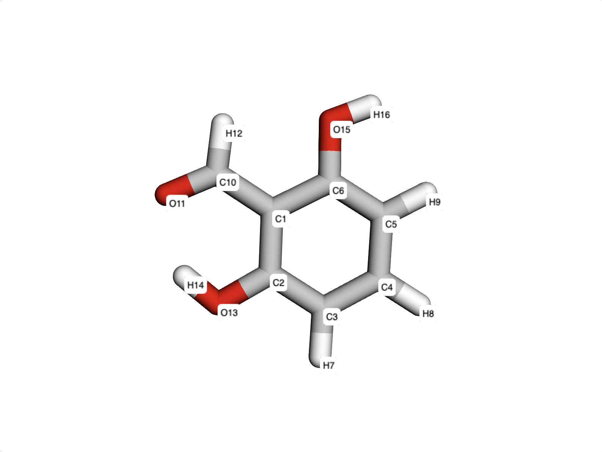
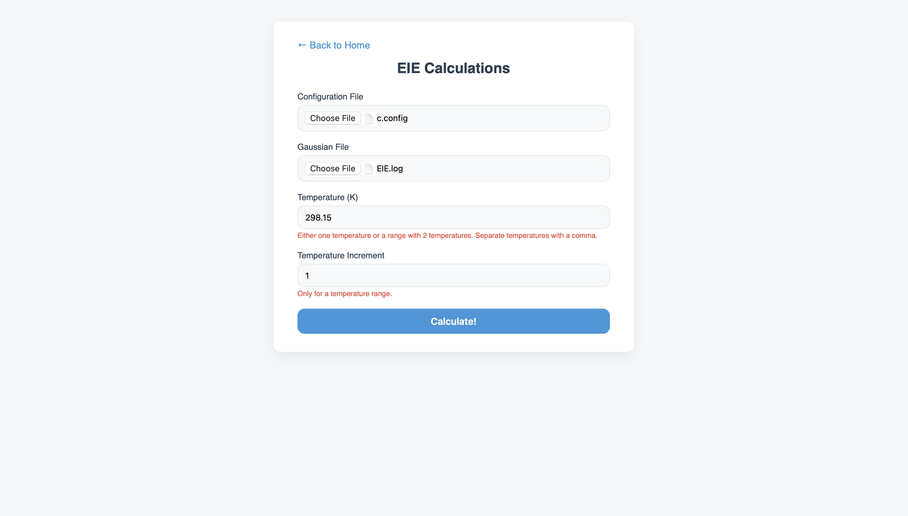
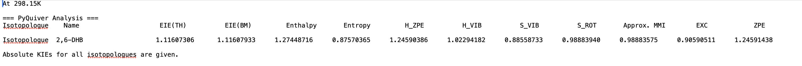

# EIE TUTORIAL
In this tutorial, we will reproduce the intramolecular hydrogen–deuterium exchange equilibrium of 2,6-dihydroxybenzaldehyde shown below in order to evaluate its equilibrium isotope effect.

|          |        |
|-----------------------------------------------|-------------------------------------------------------|
| Reaction                                      | Molecule Numbering                                    |

First, generate the configuration file through the Configuration File Generator. For a guide, please look at [config file tutorial](CONFIG.md).

After generating the configuration file, along with obtaining the Gaussian file for the equilibrium reaction (Note: this tutorial requires a verbose Gaussian output file. To ensure the necessary details are included in your output, make sure to use the #P keyword in the route section of your Gaussian input file.): 
1. Head to the EIE page
2. Upload the files in the designated sections.
3. Enter the  desired Temperature in kelvin. If a range of temperature is desired, simply enter the beginning and the end:
    * Single temperature: 298.15
    * Range of temperatures: 250, 350
4. (optional) set the increment value for temperature range.
5. Press calculate!
 

 If done correctly, you will recieve a zip file that includes .txt file for each temperature in the temperature range and increment, a .csv file that combines all of the outputs, and a plot for the temperatures. Below is an example of the output .txt run using the provided files:
 