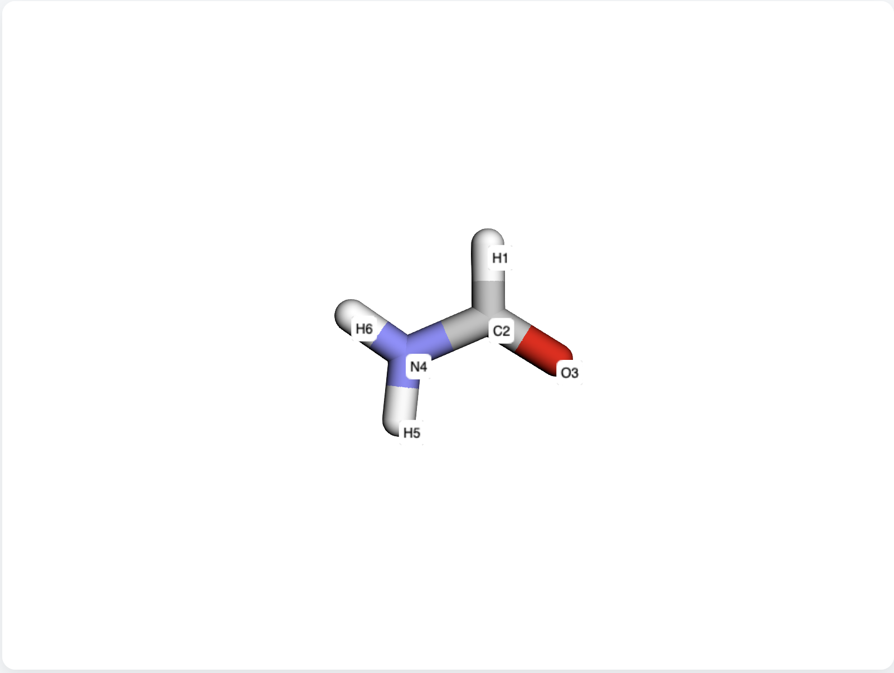
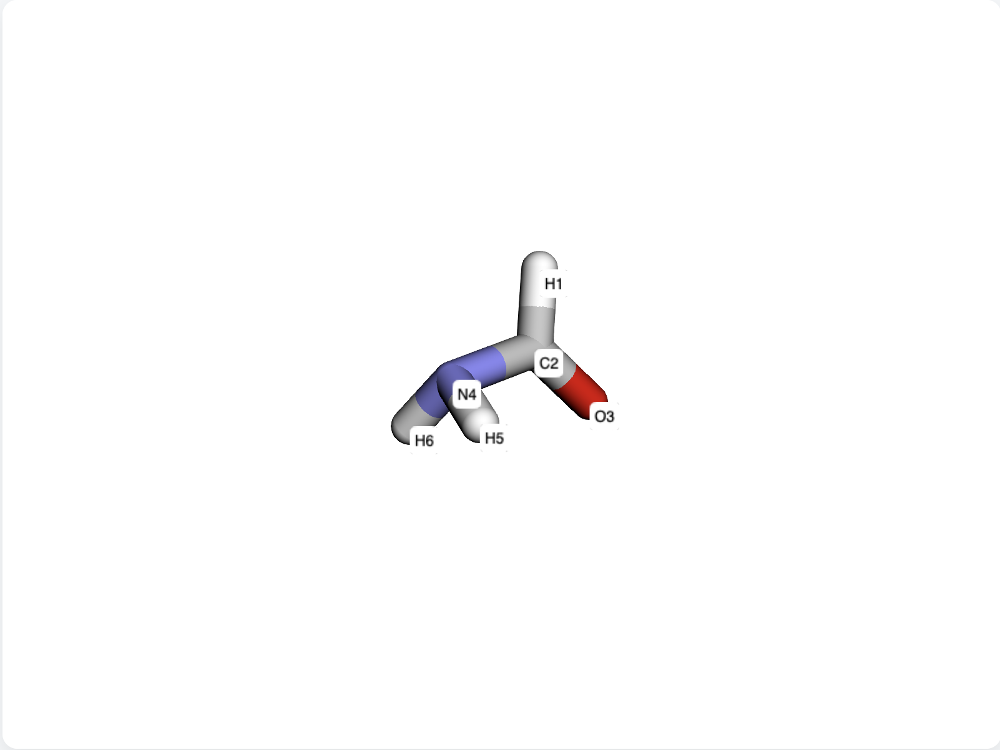
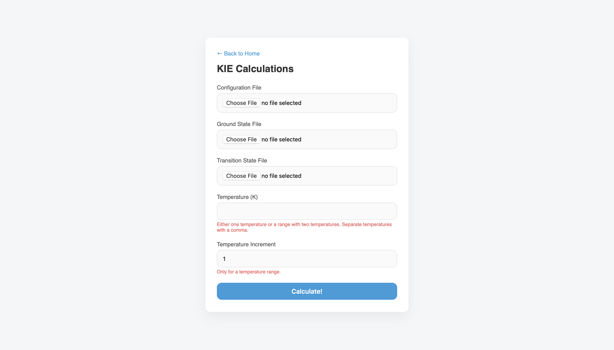
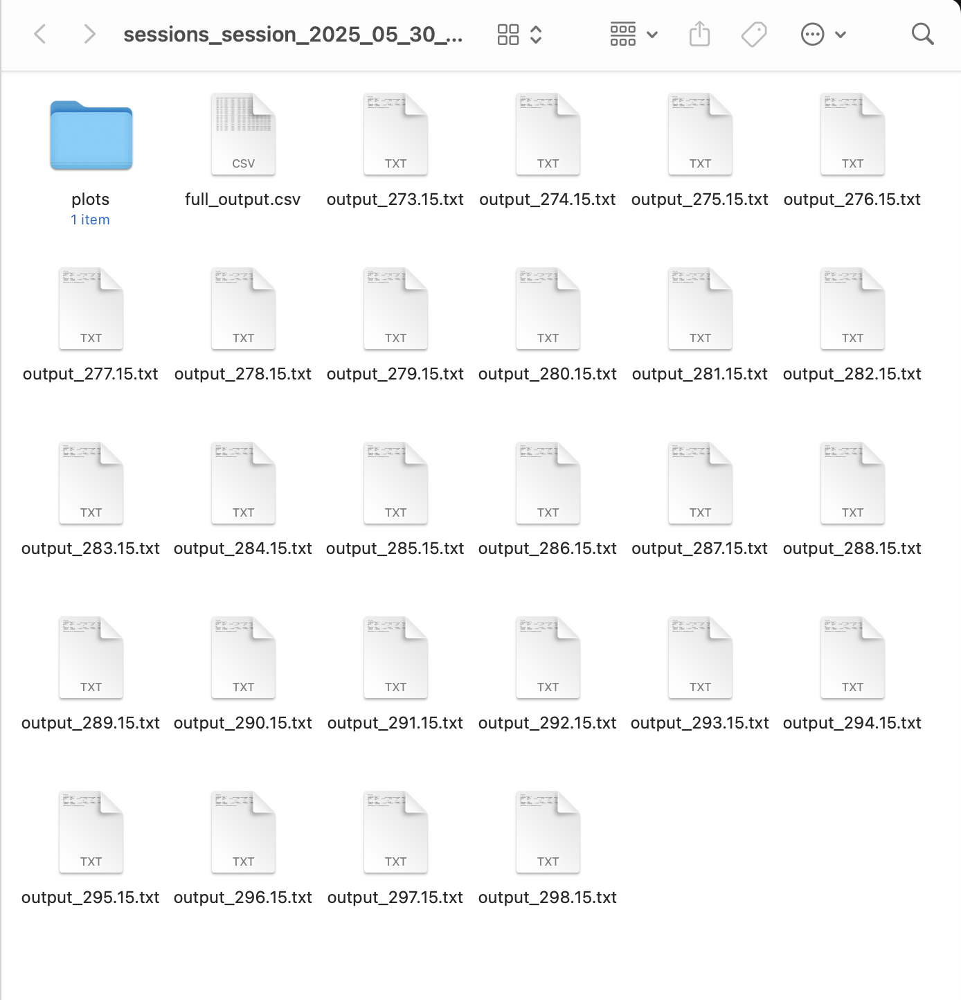
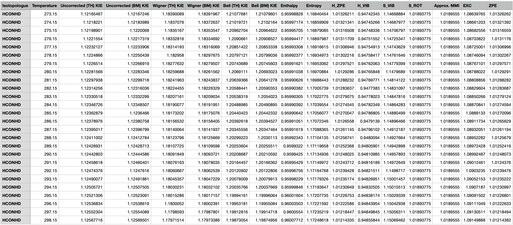
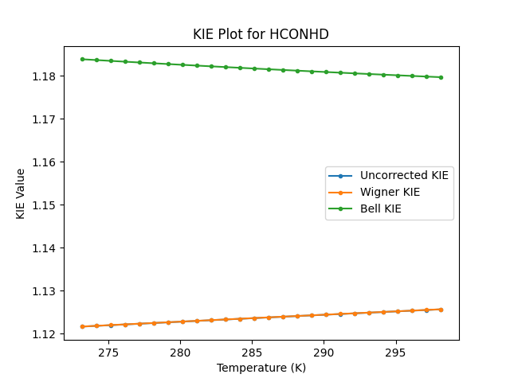

# KIE TUTORIAL
In this tutorial, we will reproduce the amide bond rotation in formamide shown below:

|  |  |
|-----------------------------------------------|-------------------------------------------------------|
| Ground State                                  | Transition State                                      |

First, generate the configuration file through the Configuration File Generator. For a guide, please look at the <a href="#" onclick="loadTutorial('/tutorials/CONFIG.md'); return false;">config file tutorial</a>.

<!-- [config file tutorial](tutorials/CONFIG.md). -->

After generating the configuration file, along with obtaining the Gaussian files for both the ground state and transition state (Note: this tutorial requires a verbose Gaussian output file. To ensure the necessary details are included in your output, make sure to use the #P keyword in the route section of your Gaussian input file.): 
1. Head to the KIE page.
2. Upload the files in the designated sections.
3. Enter the  desired temperature in Kelvin. If a range of temperature is desired, simply enter the beginning and the end points:
    * For a single temperature: 298.15
    * For a range of temperatures: 250, 350
4. (optional) Set the increment value for temperature range.
5. Press 'Calculate!'
 

Once done, you will receive a .zip file that includes a text file for each temperature in the temperature range, a .csv file that includes all of the output values, and a plot across the temperature range. Below is an example using the provided Gaussian files and a generated configuration file temperatures ranging from 273.15K to 298.15K, with increments of 1K.

