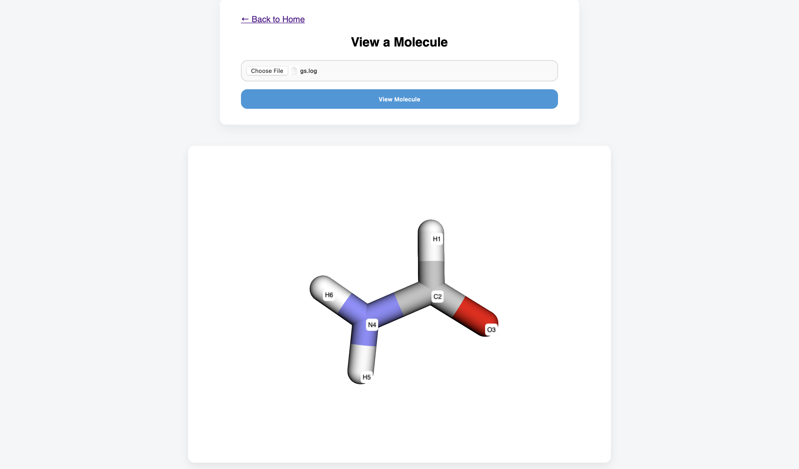

# MOLECULE VIEWER
To use this feature, simply upload the generated Gaussian output file for the molecule, and press "View Molecule": 

Note that the numbers shown on the right of the elements indicate the atom number used in steps 2 and 3 for [generating a config file](CONFIG.md)